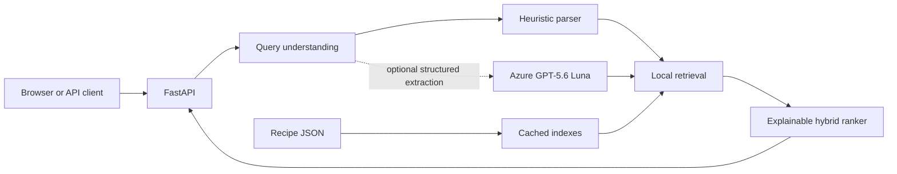

# OMAI Recipe Search

An explainable multilingual recipe-search API built for the OMAI AI Developer take-home. It
retrieves recipes from JSON using three complementary signals:

1. deterministic ingredient coverage;
2. character-aware lexical TF-IDF;
3. local multilingual semantic embeddings.

The API combines those signals with a small documented ranking function. Azure OpenAI can
optionally turn fuzzy language into structured constraints, but it never chooses recipes and the
application works without it.

[](https://github.com/ariakalantari/omai-recipe-search/actions/workflows/ci.yml)
[](https://render.com/deploy?repo=https://github.com/ariakalantari/omai-recipe-search)

## Quick start

### Docker (recommended)

The image downloads the ODC-licensed public Recipe Box development dataset and precomputes the
indexes during the build. Docker Compose uses a representative 10k slice so the first build fits a
typical laptop. No key is required.

```bash
docker compose up --build
```

Open http://localhost:8000 for the demo or http://localhost:8000/docs for OpenAPI.

After the GitHub container workflow completes, reviewers can avoid cloning and building. The
published review image contains the same prebuilt 10k representative slice:

```bash
docker run --rm -p 8000:8000 ghcr.io/ariakalantari/omai-recipe-search:latest
```

### Local Python

Requires Python 3.11–3.13 and [uv](https://docs.astral.sh/uv/).

```bash
make install
make data
cp .env.example .env
make index
make dev
```

For a fast smoke test, skip the data download and set
`RECIPE_DATA_PATH=data/sample_recipes.json`.

## API

`POST /api/search` accepts exactly one input form:

```json
{
  "query": "något starkt med torsk och kokosmjölk",
  "limit": 10,
  "mode": "hybrid",
  "ai": "auto"
}
```

or:

```json
{
  "ingredients": ["eggs", "potatoes", "onion"],
  "limit": 10
}
```

`mode` is `lexical`, `semantic`, or `hybrid`. `ai` is `auto` or `off`. Every result includes the
three component scores, matched normalized ingredients, and a human-readable reason. Limits are
bounded to 1–50 and unknown request fields are rejected.

```bash
curl -s http://localhost:8000/api/search \
  -H 'content-type: application/json' \
  -d '{"ingredients":["eggs","potatoes","onion"],"limit":3}'
```

Operational endpoints are `GET /healthz` and `GET /readyz`.

## Demo UI

The bundled frontend is deliberately small and presentation-focused. A search retrieves the top
50 ranked recipes once, then shows ten per page so paging is instant and the ranking snapshot stays
stable. Cards use user-facing relevance bands (`Best`, `Excellent`, `Strong`, and `Relevant`)
instead of exposing raw score decimals. The underlying component scores remain in the API response
for debugging, evaluation, and technical review.

Selecting a card opens a recipe detail dialog with the description, timing, yield, ingredients,
method, source link, and image when those fields exist in the dataset. Missing fields are stated
plainly; the interface does not invent recipe history, instructions, or food photography.

## Architecture



One process owns one immutable recipe collection and three read-only indexes. Startup validates
records and loads or builds the derived indexes. Search is synchronous CPU work moved off the event
loop; the provider call, when enabled, is bounded and falls back before retrieval.

Important code surfaces:

- `loader.py`: tolerant JSON ingestion, cleanup, stable IDs, and data-quality reporting;
- `normalization.py`: units, quantities, aliases, and deterministic ingredient terms;
- `search.py`: all three indexes, score calculation, and ranking weights;
- `query_understanding.py`: heuristic interpretation and the isolated Azure adapter;
- `service.py`: orchestration, AI rate limiting, fallback metadata, and response assembly;
- `main.py`: FastAPI contract and static frontend hosting.

## Ranking

All components are normalized to `[0, 1]` before combination.

| Query type | Semantic | Lexical | Ingredient | Reason |
|---|---:|---:|---:|---|
| Natural language | 0.55 | 0.25 | 0.20 | Meaning carries most information; exact words still anchor it |
| Explicit ingredients | 0.30 | 0.15 | 0.55 | Ingredient coverage is the user's strongest constraint |

If the semantic model is unavailable, its weight is redistributed across the two local signals.
`semantic` mode also falls back to lexical search instead of failing the endpoint. These defaults
are intentionally simple starting points, not learned relevance parameters.

Ingredient score is `0.8 × query coverage + 0.2 × cosine-like term overlap`. Coverage dominates so
a recipe is penalized for omitting a requested ingredient; the smaller overlap term mildly favors
focused recipes. Character 3–4 gram TF-IDF helps misspellings. Cosine similarity over normalized
multilingual MiniLM vectors bridges Swedish/Spanish queries to English recipe text.

## How AI is used—and why it is narrow

The primary AI technique is local representation learning: a pretrained multilingual encoder maps
queries and recipe text into the same vector space. This is the right tool for fuzzy cross-language
meaning.

Optional Azure GPT-5.6 Luna performs one bounded task: extract mentioned ingredients, exclusions,
preferences, and a time constraint into strict JSON. It uses low reasoning effort because entity
extraction is not a hard reasoning problem. The ranker remains deterministic and all returned facts
come from the dataset.

This is preferable to asking an LLM to pick recipes because retrieval is cheaper, reproducible,
grounded, testable, and explainable. A provider outage only changes `query_understanding.source` to
`heuristic`; search remains available.

## Azure configuration without leaked secrets

Never put the key in JavaScript, Docker build arguments, the Dockerfile, Git, or `.env.example`.
The browser calls this backend; only the backend can call Azure.

For local development or Render, add these values to the host's runtime secret store:

```dotenv
AZURE_OPENAI_BASE_URL=https://YOUR-RESOURCE.openai.azure.com/openai/v1/
AZURE_OPENAI_DEPLOYMENT=gpt-5.6-luna
AZURE_OPENAI_API_KEY=...
```

For Azure Container Apps, prefer no API key:

1. enable a system-assigned managed identity on the Container App;
2. grant it `Cognitive Services OpenAI User` on the Azure OpenAI resource;
3. set the base URL/deployment and `AZURE_OPENAI_USE_ENTRA=true`;
4. leave `AZURE_OPENAI_API_KEY` unset.

`DefaultAzureCredential` obtains and rotates the runtime token. GitHub Actions deployments should
use Azure OIDC federation rather than a long-lived service-principal secret. For a public demo,
in-process AI limits and Azure quota bound indirect key abuse; production would put a distributed
gateway quota in front of the service.

## Evaluation

The evaluation set covers Swedish, English, Spanish, explicit ingredient lists, fuzzy requests,
misspellings, and an impossible request. It runs the production path in all three modes and reports
top results, Hit@5, and mean reciprocal rank.

```bash
make evaluate
# or
uv run recipe-evaluate --data data/recipes --output evaluation/results/latest.md
```

The labels are intentionally small and human-readable. A case is excluded from aggregate metrics
when the evaluated corpus slice contains no recipe satisfying its label; this avoids blaming the
ranker for missing data. They establish whether hybrid search helps, not a statistically meaningful
benchmark. On the verified 10k slice, all three approaches reached Hit@5 of 100% on answerable
cases; hybrid ranked the first relevant result best (MRR 1.000 versus semantic 0.938 and lexical
0.875). The impossible request was low-confidence in hybrid mode, while semantic-only still found a
plausible-looking medium-confidence false positive—an instructive reason to keep multiple signals.
See `evaluation/queries.json` and `evaluation/results/representative-10k.md`.

## Tests and code quality

```bash
make test
make lint
```

Tests cover normalization, multilingual aliases, malformed records, ingredient ranking, retrieval
modes, API validation, provider fallback, and AI rate limiting. CI repeats linting and tests on every
push and pull request; a separate workflow publishes the Docker image to GHCR.

## Robustness and failure behavior

- corrupt records are skipped and counted; a wholly unusable dataset fails startup clearly;
- cache row counts and numeric values are validated; corrupt caches are rebuilt;
- semantic download/inference failure degrades to lexical + ingredient search;
- Azure timeout, quota, dependency, authentication, schema, or JSON errors use heuristics;
- empty/oversized/malformed requests receive FastAPI `422` responses;
- low-score results are labeled low-confidence rather than presented as certain;
- request text and credentials are not logged.

## Deployment choices

- **Fast review:** public GHCR image, one `docker run` command.
- **One click:** the Render button uses a 2 GB service and indexes 10k recipes. This is intentionally
  not labeled free: the measured 10k steady-state process uses about 945 MB. Add Azure secrets in
  Render's dashboard only if the optional interpreter is wanted.
- **Recommended Azure production path:** Container Apps + managed identity + an Azure OpenAI role.

The service is stateless after startup. Multiple replicas can share an immutable prebuilt image. At
larger scale, store versioned index artifacts in blob storage, load them read-only, and replace the
NumPy scan with FAISS or a managed vector/search service only after latency measurements justify it.

The 10k Docker default is an operational demo profile, not a search-engine limitation. Local Python
uses all records when `MAX_RECIPES` is unset. To produce a larger Docker artifact, set the build arg
and keep the same runtime value, for example `--build-arg MAX_RECIPES=50000` and
`-e MAX_RECIPES=50000`.

## Trade-offs, limitations, and next steps

- Ingredient parsing is deliberately approximate. It removes common quantities/units and creates
  unigrams/bigrams; it is not a culinary ontology or full quantity parser.
- The public Recipe Box surrogate contains useful methods but few valid image URLs or descriptions.
  The detail view uses a neutral missing-image state rather than broken links or generated content.
- A small alias list helps deterministic Swedish/Spanish ingredient matching. Semantic search is
  the general multilingual mechanism; the alias list should grow from observed evaluation failures.
- Static weights are transparent but not optimal. With click/judgment data, learn or tune them on a
  held-out set.
- “Vegetarian” is a fuzzy semantic preference, not a guaranteed dietary safety filter. Production
  dietary/allergen filtering needs curated metadata and hard exclusions.
- Index building is intentionally offline and local. Dataset updates require a rebuild rather than
  incremental ingestion.
- The measured 10k index build took about 4.5 minutes on a 10-core Apple laptop with four worker
  processes; loading its cached artifacts took 2.3 seconds and peaked around 945 MB RSS. The full
  corpus should be built once in CI and shipped as an artifact; 3 GB is the conservative minimum
  memory recommendation for full-corpus serving.
- The in-memory AI limiter is a demo safeguard, not cross-replica abuse prevention.
- The Azure adapter has contract/fallback tests but was not live-tested against the private Friskly
  deployment because its endpoint, deployment name, identity/role, and secret were not supplied.
  Those values belong in the runtime environment, never in this repository.

Intentionally not built: recipe generation, authentication, user histories, agents, a vector
database, microservices, Kubernetes, or a large frontend.

Detailed source-backed research is in `docs/research.md`.
