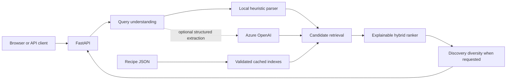
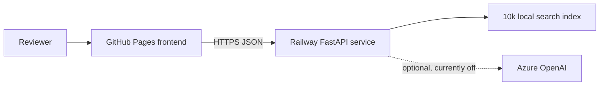

# OMAI Recipe Search

An explainable multilingual recipe search system built for the OMAI AI Developer take-home.
It accepts either a natural-language description or a list of ingredients, then ranks recipes
using deterministic ingredient matching, lexical retrieval, and local multilingual embeddings.
The deployed index is built from the exact recipe archive supplied with the assignment.

## Live demo

### [Try the deployed Recipe Search →](https://ariakalantari.github.io/omai-recipe-search/)

**No login, clone, build, API key, or local setup is required.**

- **Web application:** [ariakalantari.github.io/omai-recipe-search](https://ariakalantari.github.io/omai-recipe-search/)
- **Interactive API documentation:** [recipe-search-production-aa6b.up.railway.app/docs](https://recipe-search-production-aa6b.up.railway.app/docs)
- **Health status:** [recipe-search-production-aa6b.up.railway.app/healthz](https://recipe-search-production-aa6b.up.railway.app/healthz)

### Suggested searches

| Query | What it demonstrates |
|---|---|
| `något starkt med torsk och kokosmjölk` | Swedish meaning matched against English recipes |
| `pasta con tomate y ajo` | Spanish multilingual retrieval |
| `I have eggs, potatoes and onion` | Ingredient-oriented interpretation |
| `something quick and spicy with chicken` | Fuzzy preference and time intent |
| `vegetarian comfort food` | Broad semantic retrieval |
| `something I haven't had before` | Honest, diversity-oriented discovery fallback |

## The problem and the design choice

A language model could be asked to choose recipes directly, but that would make the core behavior
harder to reproduce, evaluate, explain, and trust. This application behaves as an information
retrieval system instead:

1. software handles exact constraints such as ingredients and limits;
2. embeddings handle fuzzy language and cross-language meaning;
3. a transparent ranker combines the retrieval signals;
4. an optional LLM may structure a difficult query, but never selects or invents a recipe.

The result is useful without any hosted AI provider and degrades safely if semantic inference is
unavailable.

## Architecture



One FastAPI process owns an immutable recipe collection and three read-only indexes. Search work
runs outside the async event loop. Optional provider calls are time-bounded and fall back to local
query understanding before retrieval continues.

### Request flow

```text
input validation
    → query normalization
    → ingredient and preference interpretation
    → lexical, semantic, and ingredient retrieval
    → weighted hybrid ranking
    → confidence and match explanation
    → paginated JSON or UI results
```

## Search and ranking

Each retrieval signal solves a different failure mode.

| Signal | Technique | Why it exists |
|---|---|---|
| Ingredient | Normalized term coverage and overlap | Exact ingredients should behave deterministically |
| Lexical | Character 3–4 gram TF-IDF with cosine similarity | Exact wording, partial terms, and misspellings still matter |
| Semantic | Multilingual MiniLM embeddings with cosine similarity | Meaning must transfer across fuzzy English, Swedish, and Spanish input |

All components are normalized to `[0, 1]` before combination.

| Query type | Semantic | Lexical | Ingredient |
|---|---:|---:|---:|
| Natural language | 0.55 | 0.25 | 0.20 |
| Explicit ingredients | 0.30 | 0.15 | 0.55 |

Natural-language queries emphasize meaning. Explicit ingredient lists emphasize coverage. These
weights are intentionally understandable defaults, not claimed to be learned or universally
optimal.

Ingredient relevance is `0.8 × query coverage + 0.2 × cosine-like term overlap`. Coverage dominates
so omitting a requested ingredient is expensive. The smaller overlap term favors focused recipes.
If semantic search fails, its weight is redistributed across ingredient and lexical retrieval.

Broad novelty requests use a separate, clearly labeled discovery strategy. Corpus-relative
distinctiveness favors less common ingredient combinations, while a small diversity reranker
reduces repeated titles and near-identical ingredient sets. The application never claims to know
the user's personal cooking history.

## How AI is used

The primary AI technique is local representation learning. A pretrained multilingual encoder maps
queries and recipe text into the same vector space. This provides cross-language and fuzzy semantic
matching without sending recipe searches to a third party.

Azure OpenAI support is optional and isolated behind the query-understanding interface. When
configured, it performs one narrow task: extracting ingredients, exclusions, preferences, and a
time constraint into validated JSON. It uses low reasoning effort because this is structured
extraction, not open-ended reasoning.

The LLM does not:

- choose the winning recipes;
- generate recipes or missing instructions;
- produce card descriptions;
- replace deterministic ingredient rules;
- become a requirement for availability.

This boundary keeps retrieval grounded, reproducible, inexpensive, and defensible in a technical
review.

## API

`POST /api/search` accepts exactly one input form.

Natural language:

```json
{
  "query": "något starkt med torsk och kokosmjölk",
  "limit": 10,
  "mode": "hybrid",
  "ai": "auto"
}
```

Ingredients:

```json
{
  "ingredients": ["eggs", "potatoes", "onion"],
  "limit": 10
}
```

`mode` is `lexical`, `semantic`, or `hybrid`. `ai` is `auto` or `off`. Unknown fields are
rejected, input length is bounded, and `limit` must be between 1 and 50.

Every result contains the recipe, normalized component scores, matched ingredients, and a
human-readable match explanation. The UI converts these details into labels such as `Best match`,
`Closest available`, and `Adventurous pick` instead of exposing raw decimals to users.

```bash
curl -s https://recipe-search-production-aa6b.up.railway.app/api/search \
  -H 'content-type: application/json' \
  -d '{"ingredients":["eggs","potatoes","onion"],"limit":3}'
```

Operational endpoints are `GET /healthz` and `GET /readyz`.

## Run locally

### Docker

Docker is the recommended local path. No API key is required.

```bash
docker compose up --build
```

Open [localhost:8000](http://localhost:8000) for the application or
[localhost:8000/docs](http://localhost:8000/docs) for OpenAPI.

Docker Compose binds only to `127.0.0.1:8000`. The build downloads the exact archive from OMAI's
public assignment repository, verifies its pinned SHA-256 digest, and precomputes a deterministic
10,000-recipe sample drawn across the full 173,278-record stream.

The published review image contains the same prebuilt index:

```bash
docker run --rm --platform linux/amd64 -p 127.0.0.1:8000:8000 \
  ghcr.io/ariakalantari/omai-recipe-search:latest
```

### Python

Requires Python 3.11–3.13 and [uv](https://docs.astral.sh/uv/).

```bash
make install
make data
cp .env.example .env
make index
make dev
```

For a fast smoke test, set `RECIPE_DATA_PATH=data/sample_recipes.json` and skip `make data` and
`make index`.

## Secrets and optional Azure configuration

Secrets are runtime configuration. They are never placed in JavaScript, Git, Docker build
arguments, the Dockerfile, or `.env.example`.

```dotenv
AZURE_OPENAI_BASE_URL=https://YOUR-RESOURCE.openai.azure.com/openai/v1/
AZURE_OPENAI_DEPLOYMENT=gpt-5.6-luna
AZURE_OPENAI_API_KEY=...
```

The browser calls FastAPI, and only FastAPI may call Azure. The public demo does not require Azure
and currently reports `ai_available: false` through `/healthz`.

For Azure Container Apps, the preferred production setup is a system-assigned managed identity:

1. grant the identity `Cognitive Services OpenAI User` on the Azure OpenAI resource;
2. set the endpoint and deployment as ordinary runtime configuration;
3. set `AZURE_OPENAI_USE_ENTRA=true`;
4. leave `AZURE_OPENAI_API_KEY` unset.

GitHub Actions should use Azure OIDC federation rather than a long-lived service-principal secret.

## Evaluation

The evaluation harness compares lexical-only, semantic-only, and hybrid retrieval over English,
Swedish, Spanish, ingredient-list, fuzzy, misspelled, and impossible queries.

```bash
make evaluate
```

Verified representative 10,000-recipe results:

| Mode | Hit@5 | Mean reciprocal rank |
|---|---:|---:|
| Lexical | 80% | 0.650 |
| Semantic | 90% | 0.692 |
| Hybrid | **100%** | **0.950** |

This is a small architectural sanity check, not a research benchmark. Cases with no satisfying
recipe in the evaluated corpus are excluded from aggregate metrics. The report also checks hard
exclusions and the low-signal discovery behavior.

See [`evaluation/queries.json`](evaluation/queries.json) and the
[`representative 10k report`](evaluation/results/representative-10k.md).

## Robustness and security

- Empty, conflicting, oversized, and malformed requests fail with compact responses.
- Bodies above 16 KiB are rejected before JSON parsing and are never reflected back.
- Corrupt recipe records are skipped and reported; a wholly unusable dataset fails startup.
- Cached row counts and numeric values are validated; corrupt or incompatible indexes rebuild.
- Semantic inference failure degrades to lexical and ingredient search.
- Azure timeouts, authentication failures, quota errors, invalid JSON, and schema errors fall back
  to local query understanding.
- Search concurrency is bounded, and optional paid AI calls have global and per-client rate limits.
- Exact canonical exclusions are removed from results, but the API does not claim allergy safety.
- Search text and credentials are not logged.
- Security headers restrict framing, MIME sniffing, browser capabilities, and content sources.
- The hosted API permits browser cross-origin access only from the exact GitHub Pages origin.
- Failed repeat searches preserve the user's previous results.
- The service exposes separate liveness and readiness endpoints.

## Deployment

### [Open the live application →](https://ariakalantari.github.io/omai-recipe-search/)

The reviewer-facing frontend is deployed automatically to GitHub Pages. GitHub Pages serves only
static HTML, CSS, and JavaScript, so the Dockerized Python API runs as a small Railway service.



The frontend contains only the public API origin, which is not a secret. Railway stores runtime
configuration, performs health checks, and sleeps the demo service while inactive to reduce cost.
The public deployment uses the same image and retrieval path tested locally.

The 10k Docker profile is an operational demo choice, not a search-engine limit. The capped loader
uses deterministic reservoir sampling so a source-ordered archive does not bias the demo toward
only its first publishers. A larger deployment would build versioned indexes once, store them in
object storage, and load them read-only at startup.

## Code map

```text
src/recipe_search/
  main.py                 FastAPI contract, middleware, health, static UI
  loader.py               tolerant JSON ingestion and data-quality reporting
  normalization.py        quantities, units, aliases, and ingredient terms
  query_understanding.py  local heuristics and isolated Azure adapter
  search.py               indexes, scoring, ranking, and discovery diversity
  service.py              orchestration, fallbacks, limits, response assembly
  summaries.py            source descriptions and factual summary fallbacks
  static/                 dependency-free browser interface
evaluation/               query set and comparison harness
scripts/                  dataset download and offline index build
tests/                    unit, retrieval, resilience, and API tests
```

## Tests and code quality

```bash
make test
make lint
```

The suite covers normalization, multilingual aliases, malformed data, scoring, ranking modes,
exclusions, API validation, CORS, provider fallback, AI limits, static assets, and UI behavior.
Ruff, mypy, and pytest run in automation. Dependency and security checks are part of submission
review.

## Trade-offs and next steps

- Ingredient parsing removes common quantities and units, but it is not a culinary ontology.
- Vegetarian and similar preferences are ranking signals, not certified dietary filters.
- Static ranking weights are explainable but should eventually be tuned on relevance judgments.
- About 9% of the supplied records lack editorial descriptions. Their deterministic title and
  ingredient summaries stay factual but are less fluent than source-written copy.
- The supplied collection almost never includes method steps. The details view shows them when
  present and otherwise links to the original recipe when a source URL is available.
- The alias list improves common Swedish and Spanish ingredients; observed failures should drive
  its growth.
- Index updates are offline rebuilds rather than incremental ingestion.
- The public service indexes a reproducible 10k sample of the supplied 173k corpus to keep a
  take-home deployment small enough to start and sleep economically.
- The in-process rate limiter is appropriate for one demo replica, not a distributed fleet.
- The full corpus would benefit from versioned object-storage artifacts and measured FAISS or
  managed-vector retrieval only after a linear NumPy scan stops meeting latency targets.
- The optional Azure adapter has contract and fallback tests but was not live-tested against a
  private deployment because no endpoint, identity, role, or secret was supplied.

Intentionally not built: recipe generation, authentication, user histories, agents, a vector
database, microservices, Kubernetes, or a large frontend.

Detailed source-backed technical research is in [`docs/research.md`](docs/research.md).
